```
Универзитет „Св. Кирил и Методиј“ – Скопје
Факултет за информатички технологии и компјутерско инженерство
```
# Проектна задача по Информациска безбедност

# Систем за оцени на студенти сличен на iKnow, каде професор

# користат сертификат за најава, а студент има само преглед на

# неговите оцени

```
Изработиле: Ќамил Какалески 195018 и Никола Анастасовски 195012
Ментор: доц. д-р Христина Михајлоска
```

Користена платформа: **Visual Studio** со. **NET MVC**.


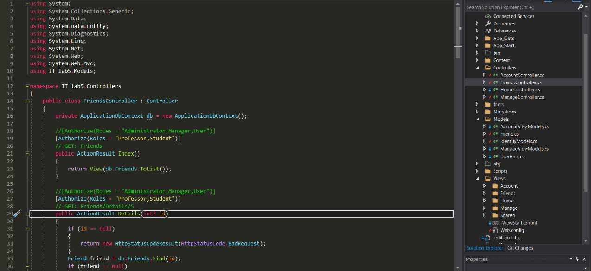


Креиравме проект template за авторизација и автентикација при што
креиравме две улоги – **професор** и **студент**.


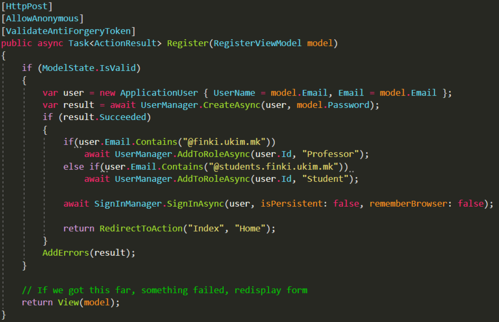


При регистрација на студентите и професорите, доколку е студент мора да
ја има наставката **@students.finki.ukim.mk** во мејлот за да биде внесен во
базата на податоци под улога студент. Доколку регистрираниот е
професор, има наставка **@finki.ukim.mk** и ја добива улогата професор во
базата на податоци.


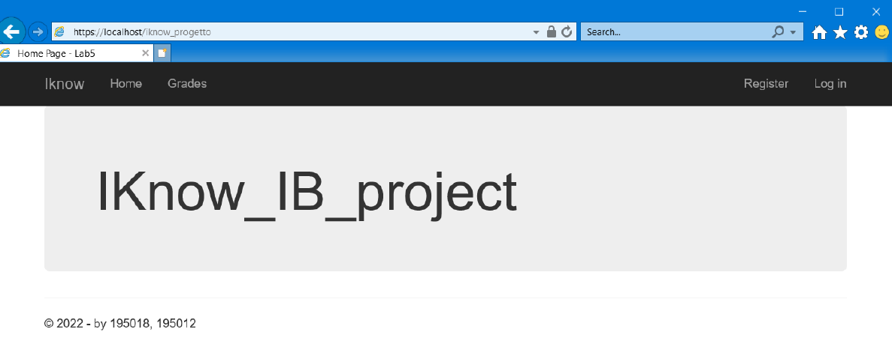


Апликацијата се поставува на **IIS сервер**.


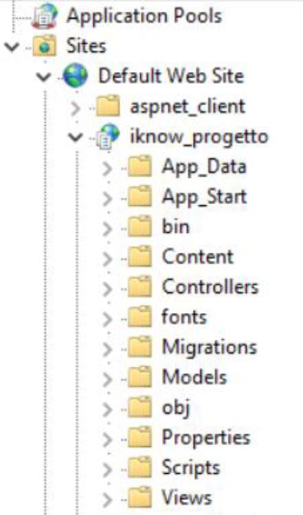


Потоа, креиравме серверски сертификат и истиот
се поставува во MMA> **Trusted Root Certificates**.

**PKI** инфрастукурата на серверскиот сертификат е
дадена на сликата:


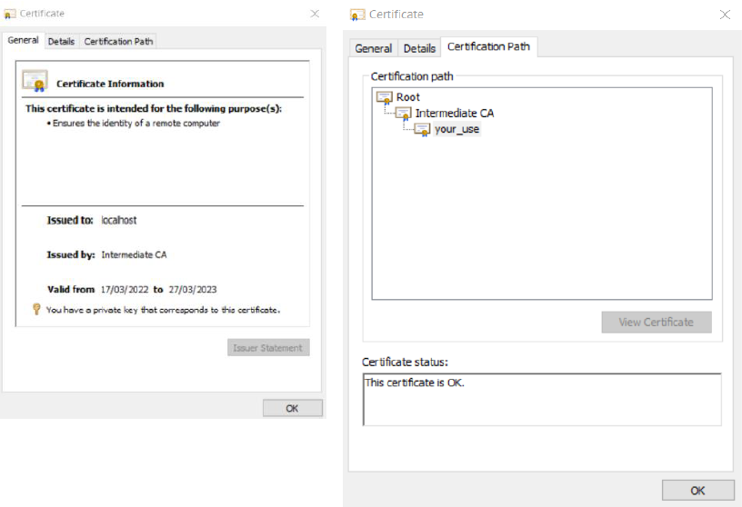


```
Сертификатите се поставуваат во IIS
серверот и потоа се подесува страната да
подржува https.
```


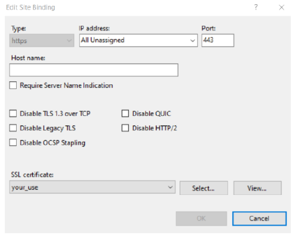


За регистриран студент страната работи на следниот начин:
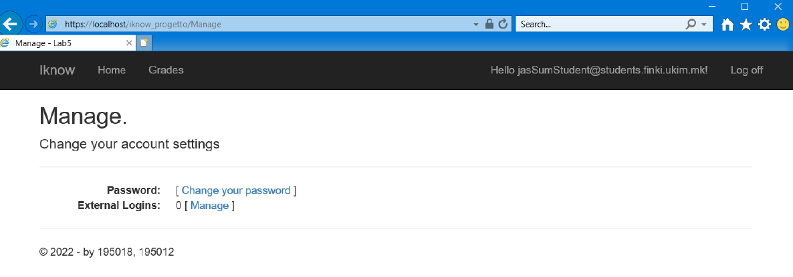


Студентот има само поглед на оцените и нема пристап до ништо друго.


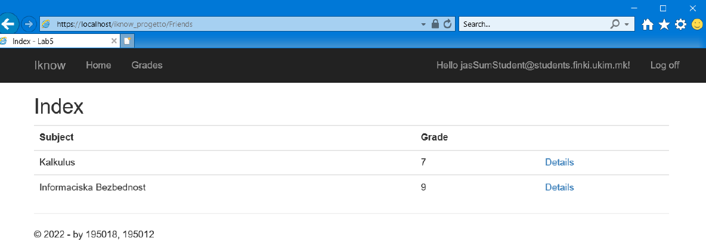


Додека професорот има дополнителна опција за менување на оцени, но
пред тоа треба да овозможи **дво-факторска автентикација** со користење
на **Google Authenticator**.


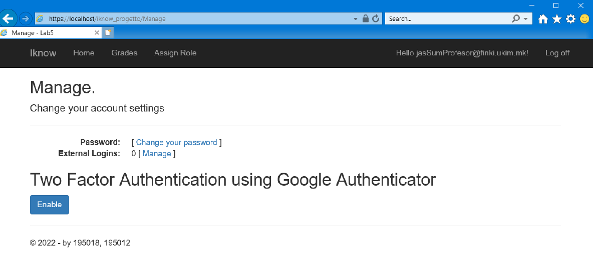


Кога професорот ќе овозвоможи 2f автентикација, му се појавува **QR Code**
кој треба да го скенира со апликацијата за телефон- **Google Auth**. При што
секој пат кога ќе се најави на сајтот ќе му биде испратен на апликацијата,
кој има **timestamp** на внесување од 20 sec.


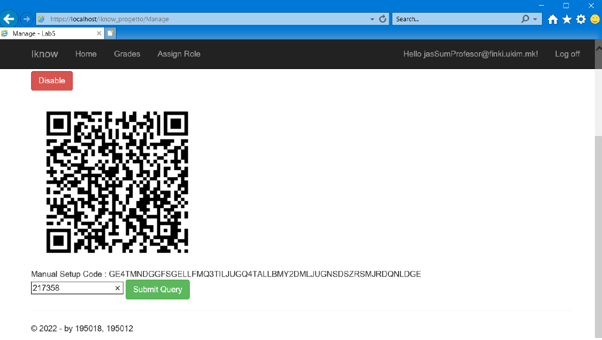


Сега професорот може да ги **менува** , **брише** или **погледне** оцените за
студентот.


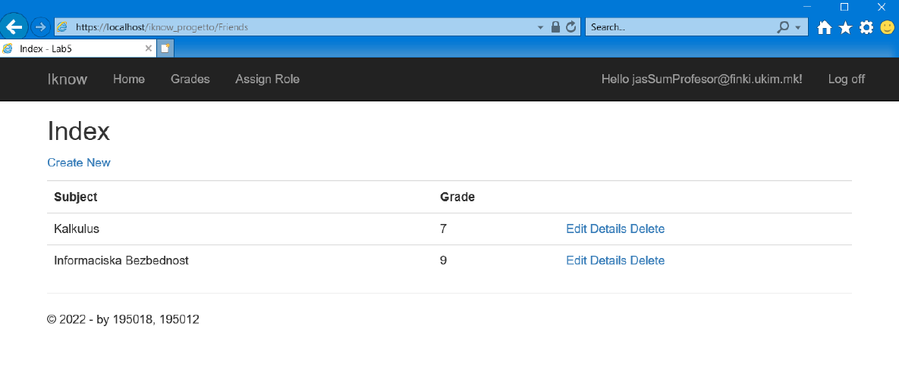


Како што напоненав, доколку професорот се одјави од сајтот и повторно
се најави, ќе му биде побаран **токен** (со одредено време) кој треба да го
внесе за да се автентицира.


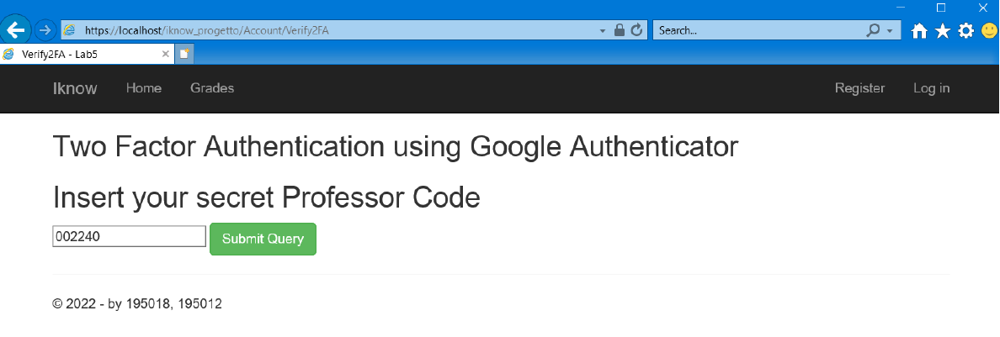


